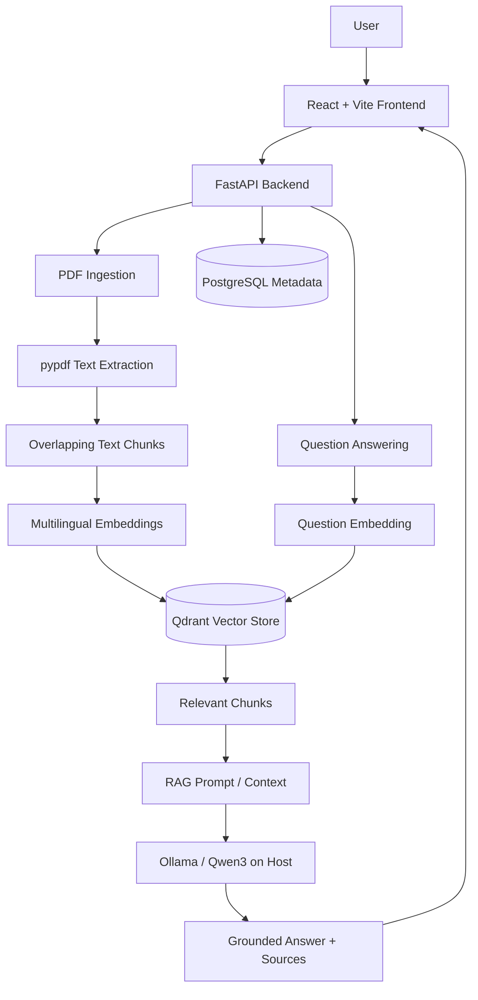

[English](README.md) | [日本語](README_JA.md)

# AI Knowledge Assistant

## Project Overview

AI Knowledge Assistant is a full-stack Retrieval-Augmented Generation (RAG) application for asking natural-language questions about uploaded PDF documents. It extracts and indexes document text, retrieves relevant passages for a question, and asks a locally running language model to produce a grounded answer with source information.

The current local setup uses Sentence Transformers and Ollama, so it does not require a paid LLM API. The project is designed as a practical portfolio example for AI application and backend engineering.

## Main Features

- PDF upload and text extraction with pypdf
- Overlapping character-based text chunking
- Local multilingual embeddings with `sentence-transformers/paraphrase-multilingual-MiniLM-L12-v2`
- Vector storage and cosine similarity search with Qdrant
- RAG question answering through a local Ollama `qwen3:1.7b` model
- Answer sources containing the filename, chunk index, and similarity score
- PostgreSQL storage for document metadata
- Document list and document deletion from both PostgreSQL and Qdrant
- SHA-256 exact duplicate detection
- Configurable retrieval similarity threshold and a no-context fallback response
- React/Vite interface for health checks, upload, document management, and Q&A
- FastAPI REST API, Docker Compose environment, and pytest backend tests

## Architecture



PostgreSQL stores relational document records such as IDs, filenames, hashes, and creation times. Qdrant stores chunk text, embeddings, and the metadata needed for retrieval and source reporting.

## RAG Flow

### Document ingestion

1. The API accepts a PDF as multipart form data.
2. pypdf extracts text from each page.
3. The text is divided into 1,000-character chunks with a 200-character overlap.
4. Sentence Transformers creates a 384-dimensional embedding for each chunk.
5. Qdrant stores the vectors together with filename, chunk index, text, and document hash.
6. PostgreSQL stores the document ID, filename, SHA-256 hash, and creation time.

### Question answering

1. The question is embedded with the same multilingual model.
2. Qdrant performs cosine similarity search and returns up to three chunks above the configured threshold.
3. The retrieved text is assembled into a prompt that instructs the model to answer only from the supplied context.
4. Ollama runs `qwen3:1.7b` locally and generates the answer.
5. The API returns the answer and source metadata. If no chunk meets the threshold, it returns `The answer cannot be found in the documents.` without calling Ollama.

## Multilingual Retrieval

The project uses `sentence-transformers/paraphrase-multilingual-MiniLM-L12-v2` for both document and query embeddings. Because semantically related text can be represented across the model's supported languages, use cases such as querying a Japanese document in English are possible.

Cross-language retrieval quality varies with the document, language pair, phrasing, and similarity threshold; it should not be interpreted as perfect translation or guaranteed accuracy.

## Tech Stack

| Category | Technologies |
| --- | --- |
| Frontend | React, Vite, JavaScript, browser Fetch API |
| Backend | Python 3.11, FastAPI, SQLAlchemy, pypdf, Uvicorn |
| AI / RAG | Sentence Transformers, multilingual MiniLM embeddings, Ollama, Qwen3 |
| Data | PostgreSQL, Qdrant |
| Infrastructure / Development | Docker, Docker Compose, Git, pytest |

## Project Structure

```text
ai-knowledge-assistant/
├── app/
│   ├── main.py                  # FastAPI routes and local CORS policy
│   ├── config.py                # Environment-based configuration
│   ├── database.py              # SQLAlchemy engine and sessions
│   ├── models.py                # PostgreSQL document model
│   ├── schemas.py               # API request schemas
│   └── services/
│       ├── document_service.py  # Ingestion, retrieval, Q&A, and metadata logic
│       ├── embedding_service.py # Sentence Transformer embeddings
│       ├── ollama_service.py    # RAG prompt and Ollama client
│       └── qdrant_service.py    # Vector storage, search, and deletion
├── frontend/
│   ├── src/
│   │   ├── App.jsx              # React application UI and API calls
│   │   └── styles.css
│   ├── package.json
│   └── vite.config.js
├── tests/                       # Backend unit and API tests
├── compose.yml                  # API, PostgreSQL, and Qdrant services
├── Dockerfile                   # Python 3.11 FastAPI image
├── pyproject.toml               # Python project and dependencies
└── .env.example                 # Local environment template
```

## API Endpoints

| Method | Endpoint | Purpose |
| --- | --- | --- |
| `GET` | `/health` | Return API health status. |
| `POST` | `/documents` | Upload and ingest a PDF using multipart field `file`. |
| `GET` | `/documents` | List document IDs, filenames, and creation times. |
| `DELETE` | `/documents/{document_id}` | Delete document metadata and its Qdrant chunks. |
| `POST` | `/search` | Search relevant chunks using `{"query": "..."}`. |
| `POST` | `/ask` | Generate an answer and sources using `{"question": "..."}`. |

Interactive API documentation is available at `http://localhost:8000/docs` while FastAPI is running.

## Local Setup

### Prerequisites

- Python 3.11
- Node.js and npm
- Docker Desktop with Docker Compose
- Ollama

Copy the tracked environment template for local Python development. Review it before use and keep `.env` out of version control.

```powershell
Copy-Item .env.example .env
py -3.11 -m venv .venv
.\.venv\Scripts\Activate.ps1
python -m pip install -e ".[dev]"
```

To run FastAPI from the virtual environment while only PostgreSQL and Qdrant use Docker:

```powershell
docker compose up -d postgres qdrant
.\.venv\Scripts\python.exe -m uvicorn app.main:app --reload
```

The local API is then available at `http://localhost:8000`.

## Ollama Setup

Install Ollama for the host operating system, then download the configured model:

```powershell
ollama pull qwen3:1.7b
```

Ensure Ollama is running and listening on port `11434`. If it is not already managed by the desktop application, start it with:

```powershell
ollama serve
```

Ollama is intentionally not containerized. The Compose API service reaches the Windows host through `host.docker.internal:11434`.

## Docker Setup

The Compose stack runs FastAPI, PostgreSQL, and Qdrant. The React development server and Ollama run on the host.

The PostgreSQL and Qdrant volumes are declared as external. Create them once on a new machine; do not recreate them when they already contain project data.

```powershell
docker volume create ai_postgres_data
docker volume create qdrant_storage
```

Build and start the stack:

```powershell
docker compose up -d --build
docker compose ps
docker compose logs api
```

Stop the containers while preserving persisted data:

```powershell
docker compose down
```

Do not use `docker compose down -v` or manually delete the named volumes when the stored PostgreSQL and Qdrant data must be retained. Deleting Docker volumes permanently removes their persisted data.

## Frontend Setup

The Vite frontend is run separately from Compose:

```powershell
cd frontend
npm install
npm run dev
```

Open `http://localhost:5173`. The current FastAPI CORS policy permits this local development origin only.

To verify a production frontend build:

```powershell
npm run build
```

## Tests

Backend tests cover health routing, text chunking and overlap, PostgreSQL document persistence and hash uniqueness, retrieval threshold filtering, request validation, mocked search/Q&A responses, and the no-context fallback.

The model tests expect a PostgreSQL database named `ai_knowledge_test` to be available. With the Compose PostgreSQL container running, create it once if necessary, then run:

```powershell
docker exec ai-postgres createdb -U postgres ai_knowledge_test
.\.venv\Scripts\python.exe -m pytest -vv
```

If the test database already exists, skip the `createdb` command.

## Design Decisions

- **Local LLM:** Ollama avoids a paid LLM API in the current setup and keeps inference under local control.
- **Multilingual embeddings:** A multilingual Sentence Transformer supports semantic retrieval across several languages without a separate translation stage.
- **Separate data stores:** PostgreSQL handles relational document metadata; Qdrant handles vector search and chunk payloads.
- **SHA-256 duplicate detection:** A content hash identifies exact duplicate files independently of their filenames.
- **Similarity threshold:** Low-scoring chunks are excluded to reduce unsupported answers, with an explicit fallback when no context qualifies.

## Current Limitations

- Ingestion supports PDF files only.
- pypdf extraction depends on the PDF's internal text structure; scanned/image-only PDFs are not OCR-processed.
- Chunking is character-based rather than sentence-, paragraph-, or token-aware.
- There is no authentication, authorization, user isolation, or chat history.
- Answers are not streamed, and the frontend uses fixed local API URLs.
- Local embedding/model startup and Ollama response time depend on available hardware; the embedding model may need an initial download.
- The repository does not currently include production/cloud deployment or a containerized frontend.
- RAG reduces unsupported generation but does not guarantee factual accuracy.

## Screenshots

> Screenshots or a short demo GIF can be added here after capturing the running application. No placeholder image is referenced so the README does not contain broken assets.
