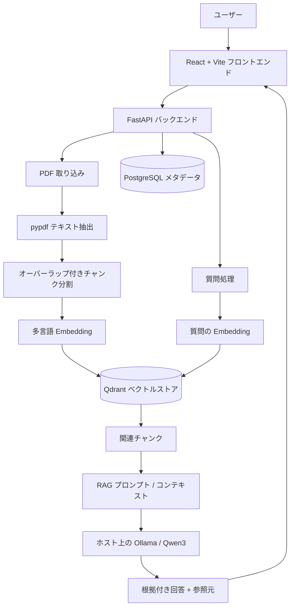

[English](README.md) | [日本語](README_JA.md)

# AI Knowledge Assistant

## プロジェクト概要

AI Knowledge Assistant は、アップロードした PDF の内容に基づいて自然言語で質問できる、フルスタックの Retrieval-Augmented Generation（RAG）アプリケーションです。文書のテキストを抽出・検索可能な形で保存し、質問に関連する箇所を取得したうえで、ローカルの LLM にコンテキストを渡し、参照元情報付きの回答を生成します。

現在のローカル構成では Sentence Transformers と Ollama を使用しているため、有料の LLM API は不要です。AI アプリケーション開発とバックエンド設計の実践例として構築しています。

## 主な機能

- PDF のアップロードと pypdf によるテキスト抽出
- オーバーラップを持たせた文字数ベースのチャンク分割
- `sentence-transformers/paraphrase-multilingual-MiniLM-L12-v2` によるローカル多言語 Embedding
- Qdrant を使ったベクトル保存とコサイン類似度検索
- Ollama 上の `qwen3:1.7b` を使ったローカル RAG 質疑応答
- 回答とともにファイル名、チャンク番号、類似度スコアを返却
- PostgreSQL による文書メタデータ管理
- 文書一覧表示、および PostgreSQL・Qdrant からの文書削除
- SHA-256 による同一ファイルの重複検知
- 類似度しきい値、および関連コンテキストがない場合のフォールバック回答
- ヘルスチェック、アップロード、文書管理、Q&A を行う React/Vite UI
- FastAPI REST API、Docker Compose 環境、pytest によるバックエンドテスト

## アーキテクチャ



PostgreSQL には文書 ID、ファイル名、ハッシュ、登録日時などのリレーショナルな情報を保存します。Qdrant には各チャンクのテキスト、Embedding、検索・参照元表示に必要なメタデータを保存します。

## RAG の処理フロー

### 文書取り込み

1. API が multipart form data として PDF を受け取ります。
2. pypdf が各ページからテキストを抽出します。
3. テキストを 1,000 文字、200 文字オーバーラップのチャンクに分割します。
4. Sentence Transformers が各チャンクを 384 次元のベクトルに変換します。
5. Qdrant にベクトルとファイル名、チャンク番号、本文、文書ハッシュを保存します。
6. PostgreSQL に文書 ID、ファイル名、SHA-256 ハッシュ、登録日時を保存します。

### 質問応答

1. 質問を文書と同じ多言語モデルで Embedding に変換します。
2. Qdrant でコサイン類似度検索を行い、設定されたしきい値以上のチャンクを最大 3 件取得します。
3. 取得したテキストを、与えられたコンテキストだけで回答するよう指示するプロンプトに組み込みます。
4. ローカルの Ollama で `qwen3:1.7b` を実行し、回答を生成します。
5. API が回答と参照元情報を返します。しきい値を満たすチャンクがない場合は Ollama を呼び出さず、`The answer cannot be found in the documents.` を返します。

## 多言語検索

文書と質問の両方に `sentence-transformers/paraphrase-multilingual-MiniLM-L12-v2` を使用しています。このモデルが対応する言語間では、意味的に近い文章を同じベクトル空間で比較できるため、たとえば日本語文書に対して英語で質問する使い方が可能です。

ただし、言語の組み合わせ、文書内容、質問表現、類似度しきい値によって検索品質は変わります。完全な翻訳や常に正確な多言語検索を保証するものではありません。

## 技術スタック

| 分類 | 技術 |
| --- | --- |
| フロントエンド | React, Vite, JavaScript, ブラウザ Fetch API |
| バックエンド | Python 3.11, FastAPI, SQLAlchemy, pypdf, Uvicorn |
| AI / RAG | Sentence Transformers, multilingual MiniLM Embedding, Ollama, Qwen3 |
| データ | PostgreSQL, Qdrant |
| インフラ / 開発 | Docker, Docker Compose, Git, pytest |

## プロジェクト構成

```text
ai-knowledge-assistant/
├── app/
│   ├── main.py                  # FastAPI ルートとローカル CORS 設定
│   ├── config.py                # 環境変数ベースの設定
│   ├── database.py              # SQLAlchemy エンジンとセッション
│   ├── models.py                # PostgreSQL 文書モデル
│   ├── schemas.py               # API リクエストスキーマ
│   └── services/
│       ├── document_service.py  # 取り込み、検索、Q&A、メタデータ処理
│       ├── embedding_service.py # Sentence Transformer Embedding
│       ├── ollama_service.py    # RAG プロンプトと Ollama クライアント
│       └── qdrant_service.py    # ベクトル保存、検索、削除
├── frontend/
│   ├── src/
│   │   ├── App.jsx              # React UI と API 呼び出し
│   │   └── styles.css
│   ├── package.json
│   └── vite.config.js
├── tests/                       # バックエンドの単体・API テスト
├── compose.yml                  # API、PostgreSQL、Qdrant サービス
├── Dockerfile                   # Python 3.11 FastAPI イメージ
├── pyproject.toml               # Python プロジェクトと依存関係
└── .env.example                 # ローカル環境変数のテンプレート
```

## API エンドポイント

| メソッド | エンドポイント | 用途 |
| --- | --- | --- |
| `GET` | `/health` | API の稼働状態を返します。 |
| `POST` | `/documents` | multipart の `file` フィールドで PDF をアップロード・取り込みします。 |
| `GET` | `/documents` | 文書 ID、ファイル名、登録日時の一覧を返します。 |
| `DELETE` | `/documents/{document_id}` | 文書メタデータと Qdrant 上のチャンクを削除します。 |
| `POST` | `/search` | `{"query": "..."}` で関連チャンクを検索します。 |
| `POST` | `/ask` | `{"question": "..."}` で回答と参照元を生成します。 |

FastAPI の起動中は `http://localhost:8000/docs` で対話形式の API ドキュメントを確認できます。

## ローカルセットアップ

### 前提環境

- Python 3.11
- Node.js / npm
- Docker Desktop（Docker Compose を含む）
- Ollama

ローカルで Python バックエンドを動かす場合は、管理対象のテンプレートから環境変数ファイルを作成します。内容を確認して使用し、`.env` は Git にコミットしないでください。

```powershell
Copy-Item .env.example .env
py -3.11 -m venv .venv
.\.venv\Scripts\Activate.ps1
python -m pip install -e ".[dev]"
```

PostgreSQL と Qdrant だけを Docker で起動し、FastAPI を仮想環境から実行する場合:

```powershell
docker compose up -d postgres qdrant
.\.venv\Scripts\python.exe -m uvicorn app.main:app --reload
```

API は `http://localhost:8000` で利用できます。

## Ollama セットアップ

ホスト OS に Ollama をインストールし、設定済みのモデルを取得します。

```powershell
ollama pull qwen3:1.7b
```

Ollama がポート `11434` で動作していることを確認してください。デスクトップアプリケーションによって自動起動されていない場合は、次のコマンドで起動できます。

```powershell
ollama serve
```

現在 Ollama はコンテナ化していません。Compose の API サービスからは `host.docker.internal:11434` を経由して Windows ホスト上の Ollama に接続します。

## Docker セットアップ

Compose では FastAPI、PostgreSQL、Qdrant を起動します。React の開発サーバーと Ollama はホスト側で実行します。

PostgreSQL と Qdrant のボリュームは external volume として定義されています。新しい環境では最初に一度だけ作成し、既存データが入っている場合は再作成しないでください。

```powershell
docker volume create ai_postgres_data
docker volume create qdrant_storage
```

イメージをビルドして起動します。

```powershell
docker compose up -d --build
docker compose ps
docker compose logs api
```

永続データを保持したままコンテナを停止・削除します。

```powershell
docker compose down
```

PostgreSQL と Qdrant のデータを保持する必要がある場合は、`docker compose down -v` や named volume の手動削除を行わないでください。Docker volume を削除すると保存データは失われます。

## フロントエンドセットアップ

Vite フロントエンドは Compose とは別に起動します。

```powershell
cd frontend
npm install
npm run dev
```

ブラウザで `http://localhost:5173` を開きます。現在の FastAPI CORS 設定では、このローカル開発用 origin のみを許可しています。

production build を確認する場合:

```powershell
npm run build
```

## テスト

バックエンドテストでは、ヘルスチェック、チャンク分割とオーバーラップ、PostgreSQL への文書保存とハッシュ一意制約、検索しきい値、リクエスト検証、モックを使った検索・Q&A 応答、コンテキストがない場合のフォールバックを確認しています。

モデルテストでは `ai_knowledge_test` という PostgreSQL データベースを使用します。Compose の PostgreSQL コンテナを起動した状態で、必要な場合のみ一度作成してからテストを実行してください。

```powershell
docker exec ai-postgres createdb -U postgres ai_knowledge_test
.\.venv\Scripts\python.exe -m pytest -vv
```

テスト用データベースがすでに存在する場合、`createdb` は実行不要です。

## 設計上の選択

- **ローカル LLM:** Ollama により、現在の構成では有料 LLM API を使わず、ローカル環境内で推論を実行できます。
- **多言語 Embedding:** 翻訳処理を別途追加せず、複数言語間で意味検索できるモデルを採用しています。
- **データストアの役割分担:** リレーショナルな文書メタデータは PostgreSQL、ベクトル検索とチャンク本文は Qdrant が担当します。
- **SHA-256 重複検知:** ファイル名に依存せず、内容が完全に同じファイルを検出します。
- **類似度しきい値:** スコアの低いチャンクを除外し、参照可能なコンテキストがない場合は明示的なフォールバック回答を返します。

## 現在の制約

- 取り込み対象は PDF のみです。
- pypdf の抽出品質は PDF 内部のテキスト構造に依存し、画像としてスキャンされた PDF に対する OCR はありません。
- チャンク分割は文字数ベースであり、文・段落・トークンの境界は考慮していません。
- 認証、認可、ユーザーごとのデータ分離、チャット履歴はありません。
- 回答のストリーミングには未対応で、フロントエンドの API URL はローカル向けに固定されています。
- Embedding モデルの初回ロードや Ollama の応答速度はハードウェアに依存し、Embedding モデルは初回ダウンロードが必要になる場合があります。
- production / cloud deployment とフロントエンドのコンテナ化は未実装です。
- RAG は根拠のない生成を減らすための仕組みであり、回答の正確性を保証するものではありません。

## スクリーンショット

> 実際にアプリケーションを起動して撮影したスクリーンショット、または短いデモ GIF を今後ここに追加できます。存在しない画像へのリンクは記載していません。
